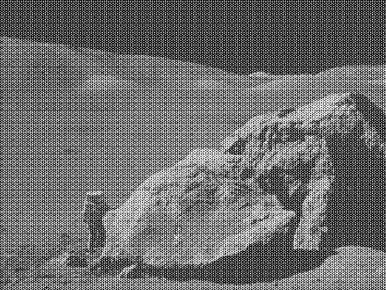
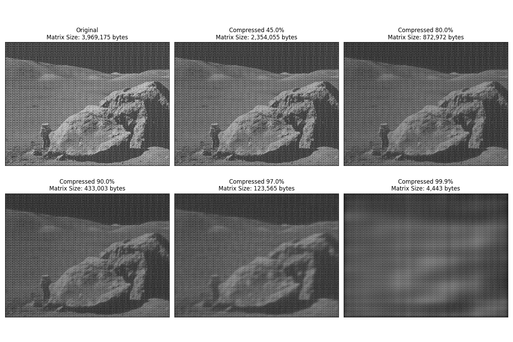
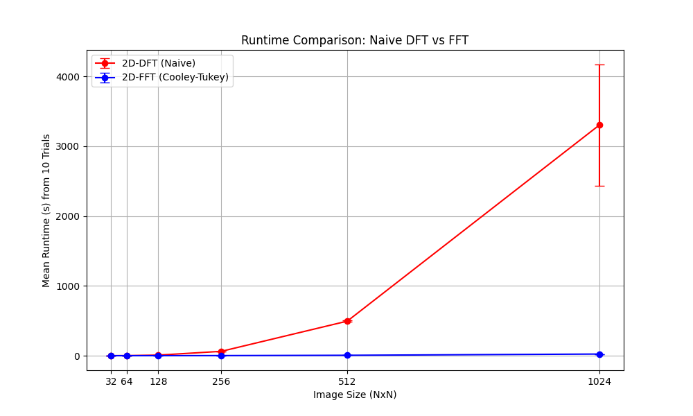

# **FFTForge**

## **Project Overview**
FFTForge is a Python-based framework designed for in-depth exploration and application of Fast Fourier Transform (FFT) techniques. 
It features custom implementations of FFT and Inverse FFT alongside comparisons with NumPy’s FFT. 
The project emphasizes signal processing concepts, image compression, and noise reduction with detailed visualizations.

---

## **Key Objectives and Features**
1. **Custom FFT Implementation and Validation**:
   - Developed a Cooley-Tukey FFT algorithm for both 1D and 2D transformations.
   - Implemented a corresponding Inverse FFT for accurate image reconstruction.
   - Benchmarked the custom FFT results against NumPy's optimized `fft2` and `ifft2` to ensure correctness.
2. **Noise Reduction and Filtering**:
   - Applied low-pass filtering in the frequency domain to effectively remove high-frequency noise while preserving essential image details.
   - Enabled configurable keep ratios to control the filtering intensity.
3. **Image Compression**:
   - Achieved data reduction by enforcing sparsity in the FFT magnitudes.
   - Analyzed trade-offs between compression levels and image quality through visual demonstrations.
4. **Visualization and Analysis**:
   - Generated detailed log-scaled magnitude plots for original, transformed, and reconstructed images.
   - Enhanced visualizations with customizable color bars and annotations highlighting denoising and compression effects.

---

## **Tools and Technologies**
- **Language**: Python
- **Libraries**: NumPy, Matplotlib, SciPy

---

## **Usage**
To execute the main program, use the following command:
 ```
 python fft.py [-m mode] [-i image]
 ```

### Arguments
   - `mode` (optional): Specify the mode of operation. Defaults to [1] Fast mode.
      - [1] Fast Mode: Converts the image to its FFT representation and displays the log-scaled magnitude.
      - [2] Denoise: Applies FFT, truncates high frequencies, and reconstructs the denoised image.
      - [3] Compress: Performs image compression in the frequency domain and visualizes results at various levels.
      - [4] Runtime Analysis: Plots runtime graphs comparing computational complexities of Naive DFT and FFT implementations.

- `image` (optional): Provide the filename of the image to process. Defaults to moonlanding.png.


---

## **Example Execution**
### **Display FFT Magnitude**
Run the program in the default fast mode with the default image:
```
python fft.py
```
Output: Displays the original image alongside its log-scaled FFT magnitude. 


### **Denoising with FFT**
Apply a low-pass filter to denoise the image, retaining various percentages of the frequency domain ranging from 1% to 90%:
```
python fft.py --mode 2 --image moonlanding.png 
```
Output Examples:
- At 8% Keep Ratio: Displays the original and denoised image at a keep ratio of 8%. 


- At 20% Keep Ratio: Displays the original and denoised image at a keep ratio of 20%. 


- At 50% Keep Ratio: Displays the original and denoised image at a keep ratio of 50%. 


### **Compression**
Compress the FFT magnitude to retain only a certain percentage of non-zero values:
```
python fft.py --mode 3 --image moonlanding.png
```
Output: Displays the original and compressed images at various compression levels, along with matrix sizes. 


### **Runtime Analysis**
Analyze and compare the runtime performance of the Naive DFT and FFT algorithms:
```
python fft.py --mode 4
```
Output: Plots the runtime comparison graph between Naive DFT and FFT. 

